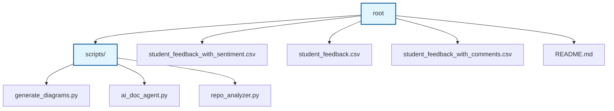

# Repository Automation System

<!-- BADGES_START -->
<!-- BADGES_END -->

## Project Overview
<!-- OVERVIEW_START -->
Welcome to the Repository Automation System. This project demonstrates a self-maintaining repository that continuously analyzes, documents, visualizes, and explains itself entirely through GitHub Actions, CI/CD pipelines, scheduled workflows, and AI agents.
<!-- OVERVIEW_END -->

## Key Features
<!-- FEATURES_START -->
- Autonomous Repository Analysis
- Self-Updating README
- Interactive Architecture Diagrams
- Repository Knowledge Graph
- AI Documentation Agent
- CI/CD Automation
<!-- FEATURES_END -->

## Technology Stack
<!-- TECH_STACK_START -->
- **GitHub Actions**: CI/CD automation.
<!-- TECH_STACK_END -->

## System Architecture
<!-- ARCHITECTURE_START -->
<!-- ARCHITECTURE_END -->

## Repository Structure
<!-- REPO_STRUCTURE_START -->
- **./**
    - student_feedback_with_sentiment.csv
    - student_feedback.csv
    - student_feedback_with_comments.csv
    - TASK_3.ipynb
    - TASK_3.pdf
    - README.md
    - **scripts/**
        - generate_diagrams.py
        - ai_doc_agent.py
        - repo_analyzer.py
<!-- REPO_STRUCTURE_END -->

## Architecture Diagrams
<!-- DIAGRAMS_START -->

<!-- DIAGRAMS_END -->

## Dependency Maps
<!-- DEPENDENCIES_START -->
### Dependency Knowledge Graph

**External Dependencies:**
`ast`, `builtins`, `openai`, `os`, `re`, `subprocess`

<!-- DEPENDENCIES_END -->

## Setup Instructions
<!-- SETUP_START -->
To set up this repository locally:
1. Clone the repository
2. Install dependencies (e.g., Python packages if any)
3. Set environment variables
<!-- SETUP_END -->

## Deployment Instructions
<!-- DEPLOYMENT_START -->
Deployment is fully automated through GitHub Actions workflows located in `.github/workflows/`.
<!-- DEPLOYMENT_END -->

## API Documentation
<!-- API_DOCS_START -->
<!-- API_DOCS_END -->

## Environment Variables
<!-- ENV_VARS_START -->
- `GITHUB_TOKEN`: Used by automation scripts to commit changes and access the GitHub API.
- `OPENAI_API_KEY` (or equivalent): Used by the AI Documentation Agent to generate content.
<!-- ENV_VARS_END -->

## Contribution Guide
<!-- CONTRIBUTION_START -->
Contributions are welcome. Please ensure that the automated pipelines pass and that you do not manually alter sections enclosed in auto-generation markers.
<!-- CONTRIBUTION_END -->

## Changelog Summaries
<!-- CHANGELOG_START -->
### Recent Automated Updates (Fallback)

The AI documentation agent detected changes in the following files:
- `.github/workflows/ci-cd.yml`

<!-- CHANGELOG_END -->
